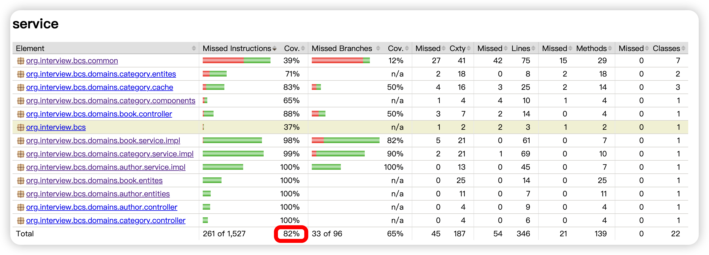

# 图书目录系统

## 功能
##### 作者
   - 增删改查
##### 分类
   - 增删改查
##### 图书
   - 增删改查
##### 出版商
   - ~~增删改查~~ 时间原因未完成

### 要求
##### 1.RESTful CRUD API(No UI needed) 
- org.interview.bcs.domains.author.controller.AuthorController
- org.interview.bcs.domains.book.controller.BookController
- org.interview.bcs.domains.category.controller.CategoryController

##### 2.Apply at least 2 design patterns in your code
- 单例模式 `org.interview.bcs.domains.category.cache.CategoryCache`
  - 场景未必合适，数据少量的一些数据可以进行缓存读取
- 观察者模式 `org.interview.bcs.domains.category.cache.CategoryListener`

##### 3.Write unit tests and integration tests. Aim for ≥ 80% code coverage
- 
